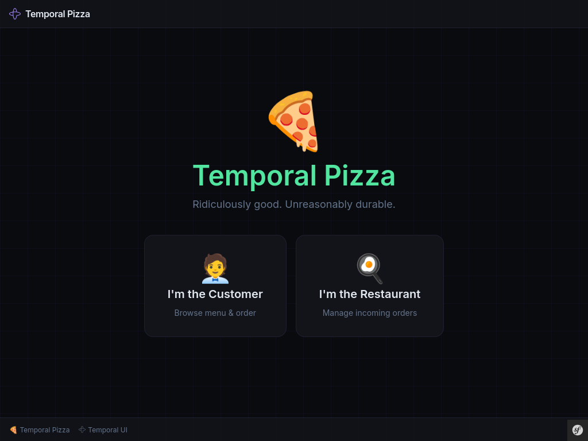
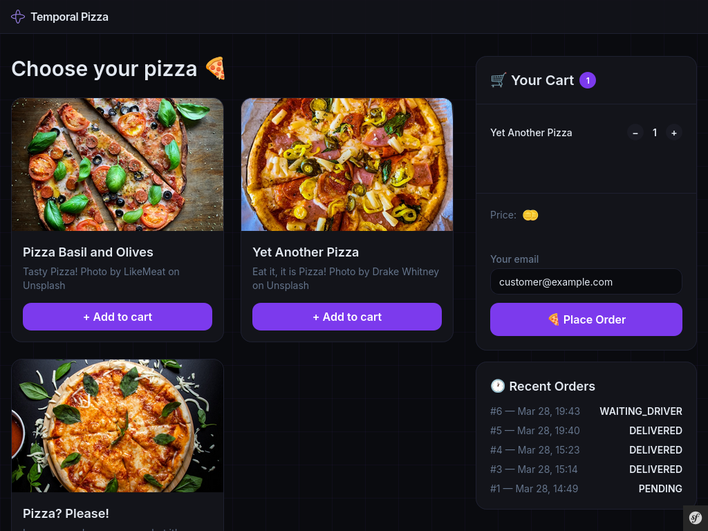
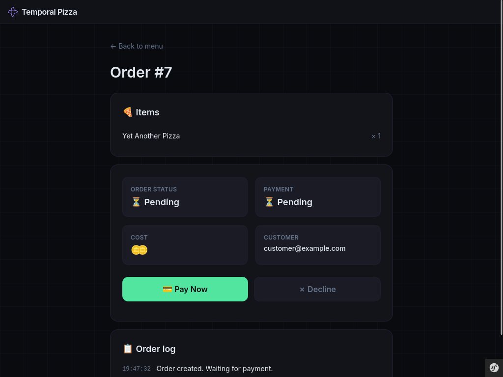
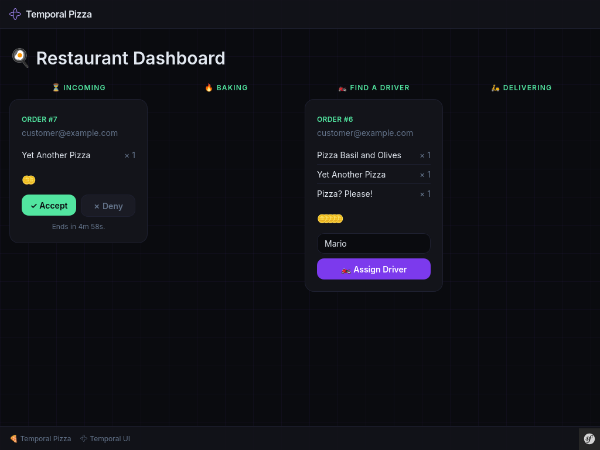

# 🍕 Temporal Pizza

> Ridiculously good. Unreasonably durable.

A demo app showcasing the [Temporal](https://temporal.io) workflow integration in the [BaldinofRoadRunnerBundle](https://github.com/Baldinof/roadrunner-bundle) (PR #166).

- Placing a pizza order triggers a **Temporal workflow**
- Two roles: **Customer** (browse & order) and **Restaurant** (manage incoming orders)
- UI uses Mercure for instant updates: open two browser windows and enjoy

## Screenshots

| Customer view | Order detail | Restaurant View |
|---|---|---|
|  |  |  |

